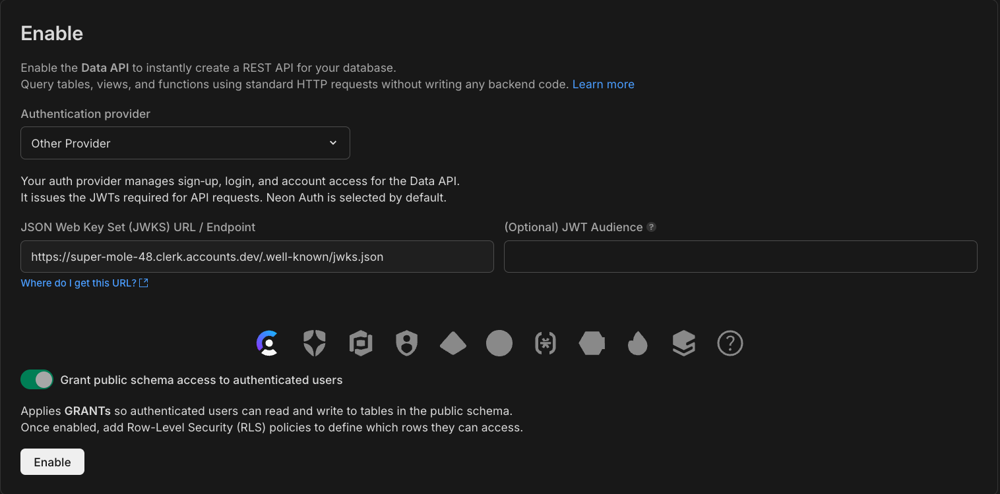

# Neon Data API + Clerk Example (SQL from the Backend)

A quick start Next.js template demonstrating secure user authentication and authorization using Postgres RLS with Clerk integration. This guide primarily uses SQL from the backend to enforce row-level security policies.

## Features

- Next.js application with TypeScript
- User authentication powered by Clerk
- Row-level security using Postgres RLS policies
- Database migrations with Drizzle ORM
- Ready-to-deploy configuration for Vercel, Netlify, and Render

## Prerequisites

- [Neon](https://neon.tech) account with a new project
- [Clerk](https://clerk.com) account with a new application
- Node.js 18+ installed locally

## One-Click Deploy

Deploy directly to your preferred hosting platform:

[](https://vercel.com/new/clone?repository-url=https://github.com/neondatabase-labs/clerk-nextjs-neon-rls&env=NEXT_PUBLIC_CLERK_PUBLISHABLE_KEY,CLERK_SECRET_KEY,DATABASE_URL,DATABASE_APPLICATION_URL,NEXT_PUBLIC_CLERK_SIGN_IN_URL,NEXT_PUBLIC_CLERK_SIGN_UP_URL&project-name=clerk-neon-rls&repository-name=clerk-neon-rls)
[](https://app.netlify.com/start/deploy?repository=https://github.com/neondatabase-labs/clerk-nextjs-neon-rls)
[](https://render.com/deploy?repo=https://github.com/neondatabase-labs/clerk-nextjs-neon-rls)

## Local Development Setup

### Configure Clerk

1. Navigate to your Clerk dashboard and create a new application.
2. Obtain your **Publishable key** and **Secret key** from the Clerk dashboard.
   
3. In your Clerk dashboard, go to **JWT Templates**.
   
4. Create a new JWT Template (select "Blank" as the template type).
   
5. Name your template (e.g., `neon_rls`).
6. Copy the **JWKS Endpoint** URL. You'll need this for Neon Data API.
   

### Set Up Neon Data API

1. Open your Neon Console and click on **Data API** in your project's settings.
2. Under **Authentication Providers**, click on **Other Provider**.
3. Paste the **JWKS Endpoint** URL you copied from Clerk into the **JWKS URL**
   field.
   

### Create Database Role

You need to create a database role that has the necessary permissions to access
the tables used by your application. You cannot use the `neondb_owner` role for
your application as it has `BYPASSRLS` enabled thus bypassing all RLS policies.

1. In the Neon Console, navigate to the **SQL Editor**.
2. Run the following SQL command to create a new role (replace `app_user` and
   `your_secure_password` with your desired role name and a strong password):

   ```sql
   CREATE ROLE app_user WITH LOGIN PASSWORD 'your_secure_password';
   ```

3. Grant the new role access to the database:

   ```sql
   -- For existing tables
   GRANT SELECT, UPDATE, INSERT, DELETE ON ALL TABLES IN SCHEMA public TO app_user;

   -- For future tables
   ALTER DEFAULT PRIVILEGES IN SCHEMA public
   GRANT SELECT, UPDATE, INSERT, DELETE ON TABLES TO app_user;

   -- For sequences (for identity columns)
   GRANT USAGE, SELECT ON ALL SEQUENCES IN SCHEMA public TO app_user;

   -- Schema usage
   GRANT USAGE ON SCHEMA public TO app_user;
   ```

### Local Installation

1. Clone the repository:

   ```bash
   git clone https://github.com/neondatabase-labs/clerk-nextjs-neon-rls
   cd clerk-nextjs-neon-rls
   ```

2. Install dependencies:

   ```bash
   npm install  # or bun install
   ```

3. Create a `.env` file in the root of the project and fill the following
   environment variables:

   ```bash
   cp .env.template .env
   ```

   ```env
   NEXT_PUBLIC_CLERK_PUBLISHABLE_KEY=YOUR_CLERK_PUBLISHABLE_KEY
   CLERK_SECRET_KEY=YOUR_CLERK_SECRET_KEY

   # For the `neondb_owner` role.
   DATABASE_URL="YOUR_NEON_OWNER_CONNECTION_STRING"

   DATABASE_APPLICATION_URL="YOUR_NEON_CONNECTION_STRING_WITH_ACCESS_TO_TABLES"

   NEXT_PUBLIC_CLERK_SIGN_IN_URL=/sign-in
   NEXT_PUBLIC_CLERK_SIGN_UP_URL=/sign-up
   ```

   > [!NOTE]
   > Replace the placeholder values with your actual Neon and Clerk credentials.

4. Run the database migrations:

   ```bash
   npm run drizzle:generate  # or bun run drizzle:generate
   npm run drizzle:migrate  # or bun run drizzle:migrate
   ```

5. Refresh the schema cache in Neon Console to ensure the new tables are
   recognized.
   - Go to the **Data API** section in your Neon Console.
   - Click on the **Refresh Schema Cache** button.

6. Start the development server:

   ```bash
   npm run dev  # or bun run dev
   ```

7. Visit `http://localhost:3000` to see the application running

   

## Important: Production Setup

Before deploying to production:

1. Modify your Clerk application environment to use the Production instance.
   Create one if you haven't already.
   
2. Update your environment variables with the new production credentials
3. Update your authentication configuration in Neon Data API to use the production
   JWKS URL from Clerk.

## Learn More

- [Neon Data API](https://neon.com/docs/data-api/get-started)
- [Simplify RLS with Drizzle](https://neon.tech/docs/guides/neon-rls-drizzle)
- [Clerk Documentation](https://clerk.com/docs)

## Authors

- [David Gomes](https://github.com/davidgomes)
- [Pedro Figueiredo](https://github.com/pffigueiredo)
- [Raouf Chebri](https://github.com/raoufchebri)

## Contributing

Contributions are welcome! Please feel free to submit a Pull Request.
